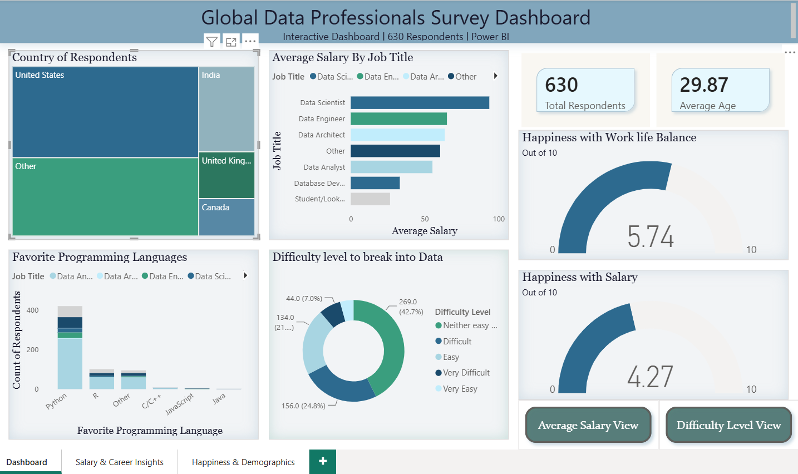

# Global Data Professionals Survey Dashboard

## Overview
An interactive 3-page Power BI dashboard analyzing survey responses from 630 data professionals worldwide. Built to uncover salary trends, 
career insights and happiness metrics across the data industry.

## Pages
- **Page 1 — Main Dashboard**: Country distribution, salary by job title, programming languages, difficulty level, happiness gauges.
- **Page 2 — Salary & Career Insights**: Salary by education, programming language, age group trends, career switcher analysis.
- **Page 3 — Happiness & Demographics**: Happiness by job title, education distribution, ethnicity breakdown.

## Key Insights
- 🇺🇸 United States has highest average salary among all countries
- Better Salary is the #1 priority when looking for a new job
- Bachelor's degree holders make up 52% of survey respondents
- 59% of respondents did not switch careers into data
- Average happiness with salary is only 4.27 out of 10
- Work life balance satisfaction (5.74) is higher than salary satisfaction
- Python dominates as the favorite programming language

## Features
- Bookmark buttons for switching chart views
- Dropdown slicers for Age Group, Education Level, Job Title, Country
- Back and Reset navigation buttons
- KPI cards for key metrics
- Cross-page consistent theme and design

## Tools Used
- Power BI Desktop
- Power Query — data cleaning and transformation
- DAX — calculated measures and columns

## Files
- `Project.pbix` — Full Power BI file
- `Raw_Data.xlsx` — Original survey dataset

## Author
**Nirmal Shaw**
- Portfolio: nirmal-shaw.github.io
- LinkedIn: linkedin.com/in/nirmal-shaw
